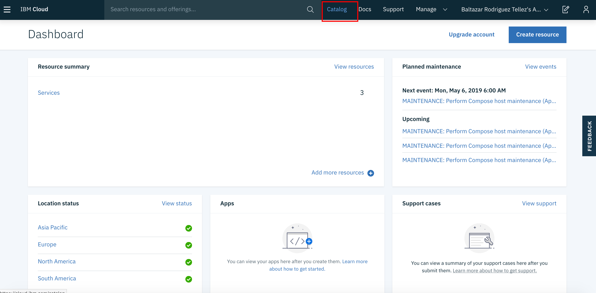
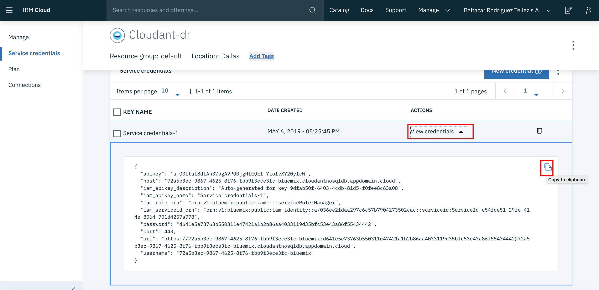

# Creando un Servicio Cloudant
## Introducción
¿Qué es Cloudant? Cloudant es una base de datos documental que almacena la información en documentos json, lo cual lo hace una solución ideal para almacenar objetos sin necesidad de utilizar un mecanismo de mapeo relacional (__ORM__)
## Creación del Servicio
1. Entramos a el  y nos firmamos. Una vez dentro del dashboard, seleccionamos la opción de catálogo 

2. Dentro del catálogo debemos buscar "cloudant" dentro del campo del filtro de servicios y seleccionamos el servicio dando click sobre el icono 

3. Al entrar a la pantalla de configuración del servicio de cloudant, seleccionamos como método de autenticación "Legacy credentials and IAM". Acto seguido, damos click en el botón de crear 

4. Una vez creado el servicio, nos aparece dentro del __Dashboard__ bajo el listado de servicios. Cabe mencionar que durante algunos minutos, el servicio no estará disponible mientra se indica como __Provision in progress__ 

5. Una vez que el servicio ha sido aprovisionado y su estado ha cambiado a __Provisioned__ debemos entrar a configurar el servicio dando click sobre el nombre de la instancia 

6. Una vez entrando en la ficha del servicio cloudant, debemos dar click sobre el botón de desplegar el __Dashboard del servicio__ 

7. Dentro del __Dashboard de Cloudant__ seleccionamos la opción en el menú de crear base de datos y ponemos de nombre __recetario__ 

8. Luego de crear la base de datos, regresamos a la pantalla que contiene la ficha de cloudant y seleccionamos la opción __Service Credentials__ del menú que se encuentra del lado izquierdo 

9. Dentro de la pantalla de configuración de credenciales, damos click sobre el botón de crear credenciales 

10. Aceptamos la configuración default de las credenciales y damos click sobre el botón de agregar 

11. Finalmente al regresar a la pantalla anterior, damos click sobre el botón de __View credentials__ lo que despliega las credenciales recien creadas. Acto seguido, damos click en el icono de copiar y copiamos las credenciales a un archivo de texto para futura referencia 