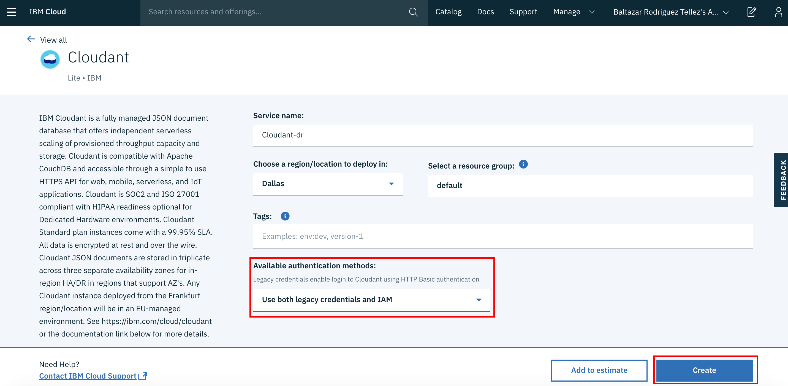

# Creando un Servicio Cloudant
## Introducción
¿Qué es Cloudant? Cloudant es una base de datos documental que almacena la información en documentos json, lo cual lo hace una solución ideal para almacenar objetos sin necesidad de utilizar un mecanismo de mapeo relacional (__ORM__)
## Creación del Servicio
1. Entramos a el  y nos firmamos. Una vez dentro del dashboard, seleccionamos la opción de catálogo 
2. Dentro del catálogo debemos buscar "cloudant" dentro del campo del filtro de servicios y seleccionamos el servicio dando click sobre el icono 
3. Al entrar a la pantalla de configuración del servicio de cloudant, seleccionamos como método de autenticación "Legacy credentials and IAM". Acto seguido, damos click en el botón de crear 