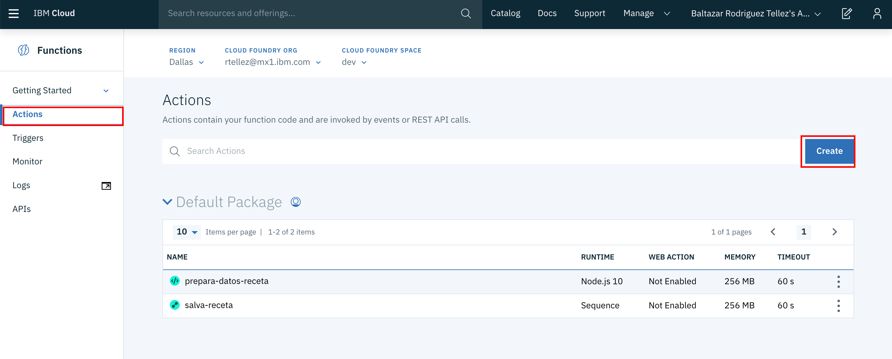
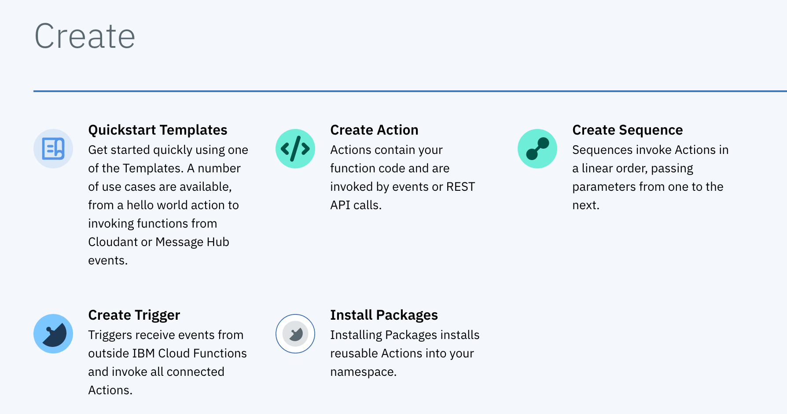
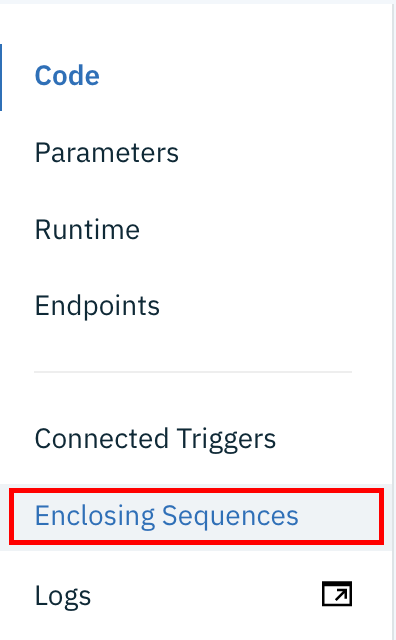
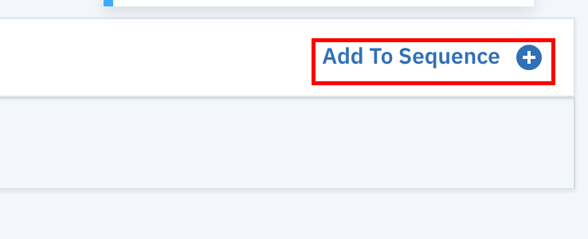
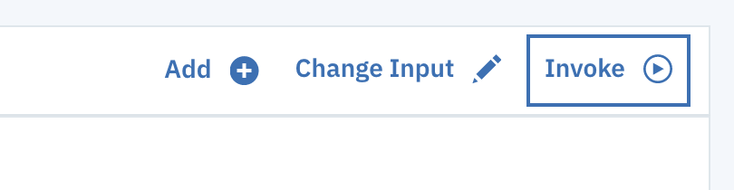
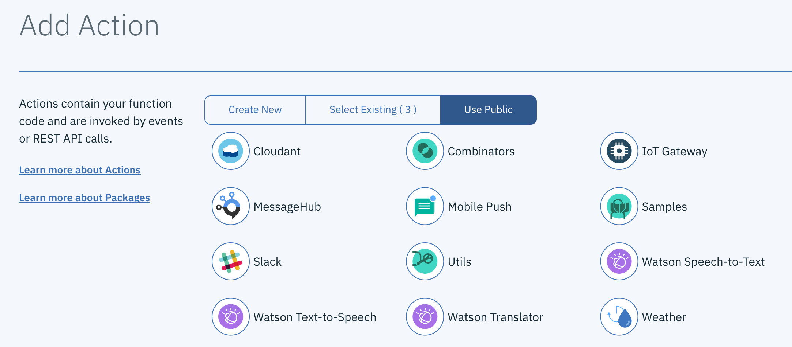

# Función para consultar los registros
## Introducción
Nuestro tercer objetivo, consiste en crear una función para recuperar aquellos registros de la base de datos que cumplan con tener un contenido calórico igual o menos que el valor del parámetro de consulta

## Configuración
1. Nos aseguramos de seleccionar en el menú de la izquierda la opcion de __Actions__ y luego damos click en el botón de __Create__ 

2. Dentro de la pantalla de creación, nos aseguramos de crear una acción 

3. Nombramos la acción como __configura-consulta__ y damos click en el botón de __create__ 

4. En la pantalla de edición agregamos el siguiente código fuente y damos click en __Save__
```
/**
 * Prepara la consulta al recetario
 */
function main(params) {
    if (!params.calorias) {
        return Promise.reject({ error: 'no se especifica el tope de calorías'});
    }
  
    return {
      query: {
          selector: {
              calorias: {
                  "$lte": params.calorias
              }
          },
          sort:["calorias","nombre"]
        }
    };
}
```
5. Ahora del menú izquierdo seleccionamos la opción __Enclosing Sequences__ para crear una secuencia de comandos y agregar la acción recien creada a ella 

6. Nuevamente al igual que en la sección anterior, al no existir una secuencia crearemos una nueva dando click al botón __Add to sequence__ 

7. En esta pantalla seleccionamos __Create New__, acto seguido nombramos la secuencia como __consulta-recetas__ y damos click en __Create & add__ 

8. Una vez creada la secuencia, damos click en su nombre para editar otras acciones 

9. Ahora, damos click sobre el botón __Add__ para crear una nueva actividad 

10. Seleccionamos el tipo como __Use Public__ y el subtipo como __Cloudant__ 

11. Ahora, definimos el tipo de acción como __exec-query-find__ y nos cercioramos de usar un binding existente, en este caso __binding-recetario__

12. Finalmente, agregamos una tercera actividad en la que vincularemos una actividad previamente creada, por lo que seleccionaremos el botón __Select Existint__ y acto seguido seleccionaremos la acción __formatea-respuesta__ y daremos click en el botón __Add__

13. Para probar pasaremos un parámetro con un número meta de calorias, por lo que daremos click en el botón __Change Input__ y agregaremos la siguiente estructura json
```
{
    "calorias": "500"
}
```


