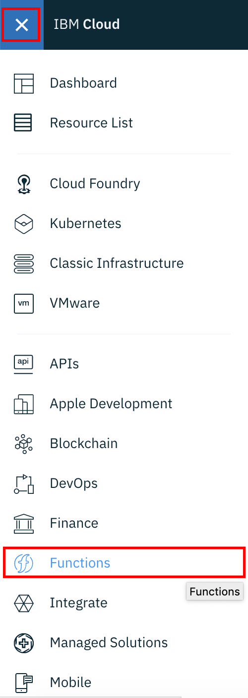
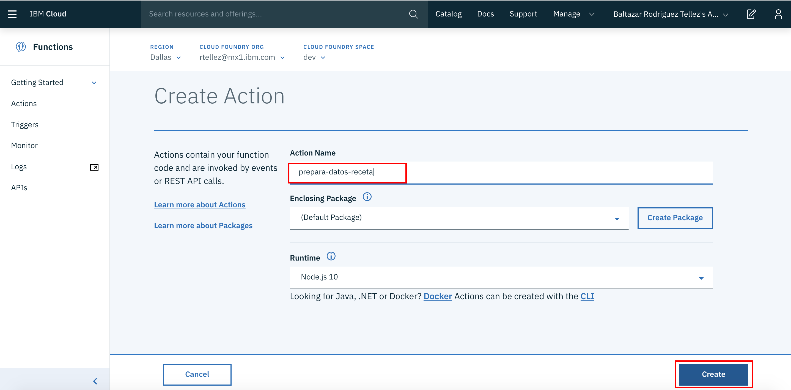
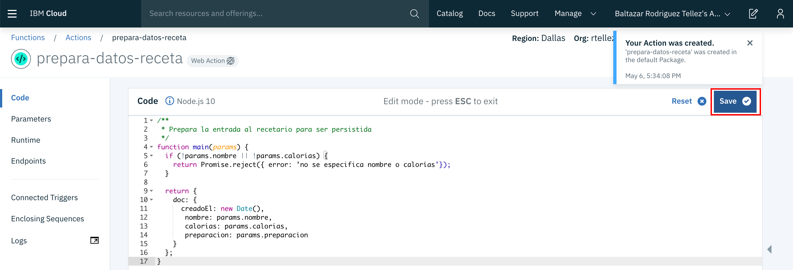
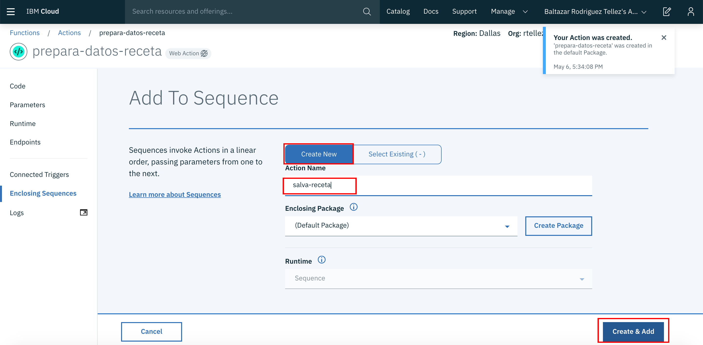
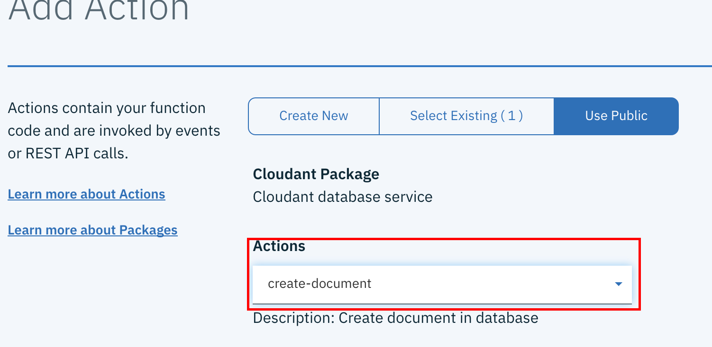
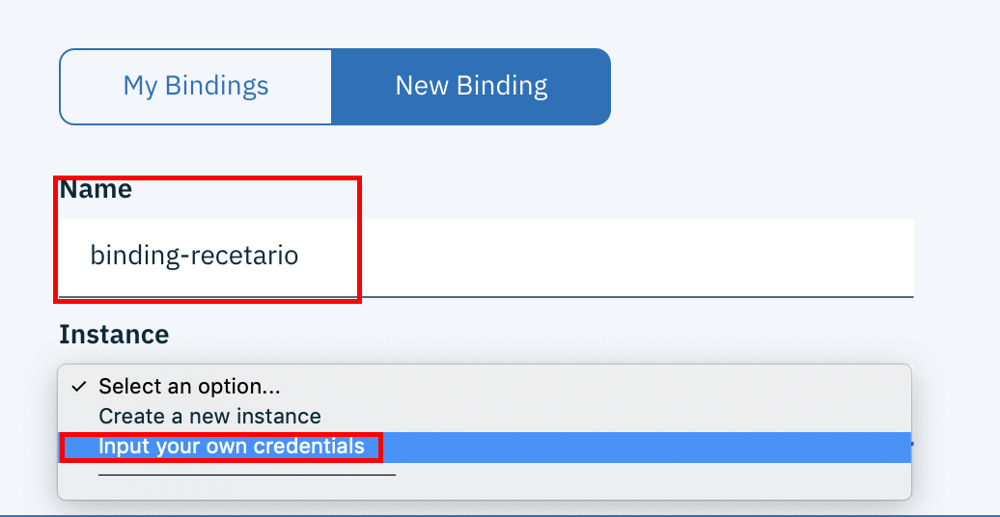
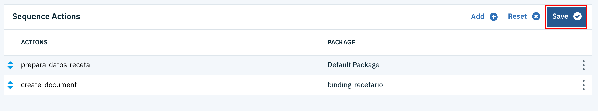
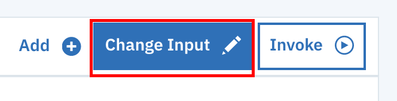

# Función para crear un registro
## Introducción
Nuestro primer objetivo, consiste en crear una función para agregar registros a la base de datos

## Configuración
1. Entramos a el  y nos firmamos en caso de ser necesario. Seleccionamos el icono superior izquierdo, lo que despliega un menú de donde seleccionaremos la opción __Functions__ 

2. Al entrar al panel de control de los __IBM Cloud Functions__ elegimos del menú del lado izquierdo la función __Actions__ 

3. Una vez dentro de __Actions__ debemos dar click en el botón de crear acción 

4. Para crear la acción debemos llenar la ficha de meta datos, para lo que crearemos el nombre (prepara-datos-receta) y acto seguido damos click en el botón de crear 

5. Al entrar al editor de código, debemos capturar los siguientes datos 
```
/**
 * Prepara la entrada al recetario para ser persistida
 */
function main(params) {
  if (!params.nombre || !params.calorias) {
    return Promise.reject({ error: 'no se especifica nombre o calorías'});
  }

  return {
    doc: {
      creadoEl: new Date(),
       nombre: params.nombre,
       calorias: params.calorias,
       preparacion: params.preparacion
    }
  };
}
```

6. Una vez capturado el código, lo salvamos dando click en el botón de salvar 

7. Una vez que hemos salvado, debemos seleccionar la opción de __Enclosing Sequences__ del menú del la izquierda. 

8. Como aún no hemos creado una secuencia, debemos dar click sobre el botón de __Add to Sequence__. 

9. En la pantalla de creación de secuencia, debemos asegurarnos de que seleccionamos la opción __Create New__, luego ponemos el nombre __salva-receta__ y finalmente hacemos click en __Create & add__ 

10. Al finalizar la creación de la secuencia, la seleccionamos para agregar otros pasos. 

11. Al entrar a editar la secuencia, vemos la acción anterior ya dentro de la secuencia. Ahora agregaremos una acción adicional para lo que daremos click en el botón de __Add__ 

12. Al crear una acción tenemos varias alternativas. En este caso, seleccionamos inicialmente la opción __Use Public__ y dentro de esta, la opción de __Cloudant__ 

13. Una vez creado, se nos muestra distintas opciones de acción con cloudant, para lo que seleccionaremos la opción para crear un nuevo documento, __create-document__ 

14. Ahora debemos especificar una conexion al la base de datos. Como aun no hemos creado una, debemos seleccionar la opción __New Binding__ 

15. Una vez seleccionado, debemos nombrar la conexion, en este caso __binding-recetario__ y en la información de instancia seleccionamos la opción para usar credenciales previas 

16. Ahora debemos proporcionar los parametros generados durante la creación de las credenciales, tomando de ellas el Username, el Password y el Host. Para el nombre de la base de datos usaremos el nombre definido previamente, que fue __recetario__. Luego de llenar los datos, damos click en el botón de __Add__ 

17. Al agregar, regresamos a la pantalla de secuencia y damos click en el botón de __Save__ para grabar los cambios. 

18. Para probar, ahora deberemos generar una entrada. Para hacer esto debemos crear unos parámetros para lo que daremos click en el botón de __Change Input__ 

19. Ahora en el dialogo que nos aparece, debemos capturar la siguiente estructura json, al final presionamos __Apply__ para salvar el parámetro
```
{
  "nombre": "Chilaquiles con Claras",
  "calorias": "500",
  "preparacion": "Ejemplo"
}
```
20. Ahora damos click sobre el botón de __Invoke__ para probar nuestra primera función 

21. Si la ejecución es correcta, debemos ver una pantalla similar a la siguiente 

Ahora continuamos con [Acción para enlistar registros](./EnlistaRegistros.md)