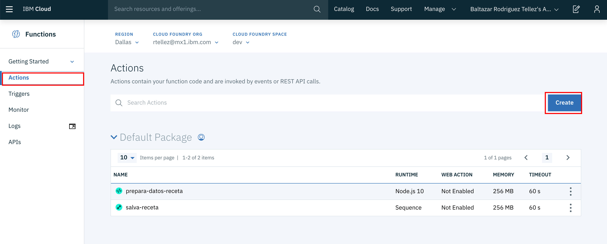
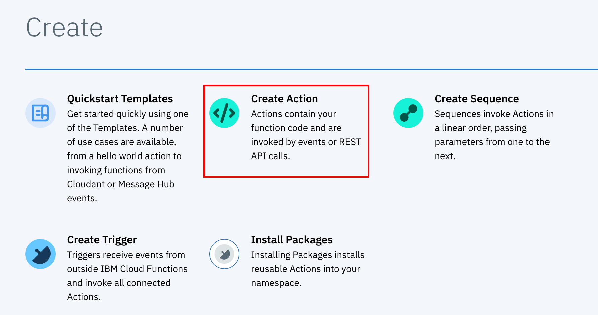
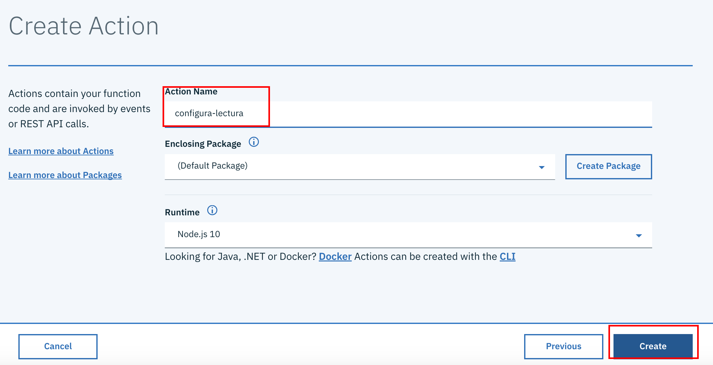
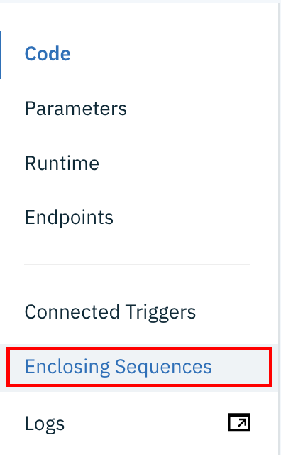
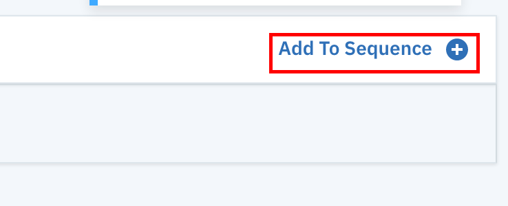
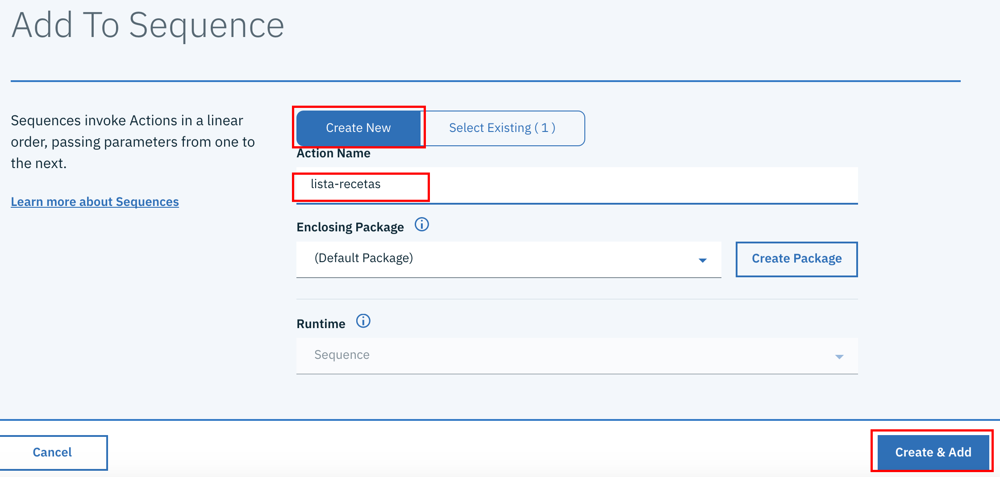
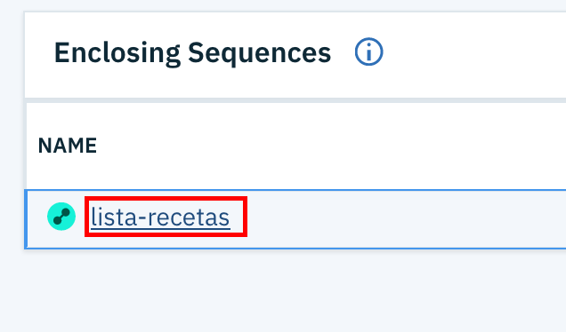
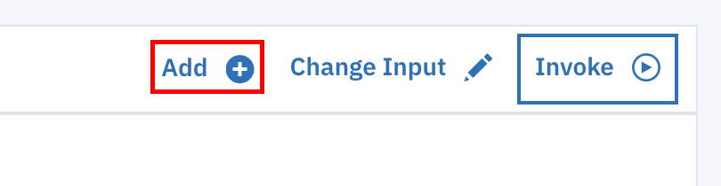

# Función para enlistar los registros
## Introducción
Nuestro segundo objetivo, consiste en crear una función para recuperar la totalidad de registros de la base de datos

## Configuración
1. Nos aseguramos de seleccionar en el menú de la izquierda la opcion de __Actions__ y luego damos click en el botón de __Create__ 

2. Dentro de la pantalla de creación, nos aseguramos de crear una acción 

3. Nombramos la acción como __configura-lectura__ y damos click en el botón de __create__ 

4. En la pantalla de edición agregamos el siguiente código fuente y damos click en __Save__
```
/**
 * Prepara la consulta al recetario
 */
function main(params) {
    return {
        query: {
            selector: {
                calorias: {
                    "$exists": true
                }
            },
            sort:["calorias","nombre"]
        }
    };
}
```
5. Ahora del menú izquierdo seleccionamos la opción __Enclosing Sequences__ para crear una secuencia de comandos y agregar la acción recien creada a ella 

6. Nuevamente al igual que en la sección anterior, al no existir una secuencia crearemos una nueva dando click al botón __Add to sequence__ 

7. En esta pantalla seleccionamos __Create New__, acto seguido nombramos la secuencia como __lista-recetas__ y damos click en __Create & add__ 

8. Una vez creada la secuencia, damos click en su nombre para editar otras acciones 

9. Ahora, damos click sobre el botón __Add__ para crear una nueva actividad 

10. Seleccionamos el tipo como __Use Public__ y el subtipo como __Cloudant__ 

11. Ahora, definimos el tipo de acción como __exec-query-find__ y nos cercioramos de usar un binding existente, en este caso __binding-recetario__

12. Finalmente, agregamos una tercera actividad que nombraremos __formatea-respuesta__ a la que agregaremos el siguiente código
```
function main(params) {
  return {
    entries: params.docs.map((doc) => { return {
      nombre: doc.nombre,
      calorias: doc.calorias,
      preparacion: doc.preparacion,
      creadoEl: doc.creadoEl,
    }})
  };
}
```

Ahora continuamos con [Acción para consultar registros](./ConsultaRegistros.md)
