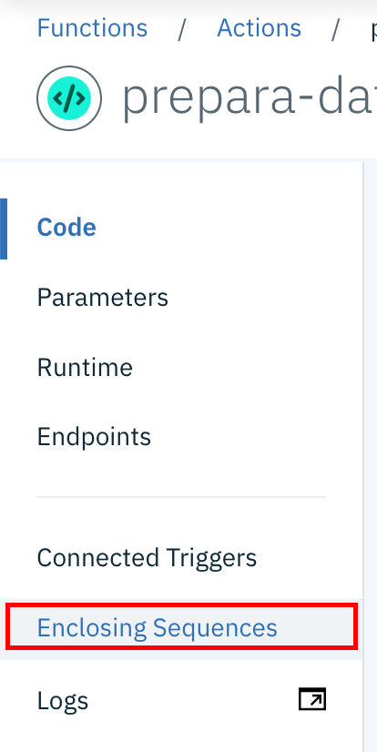
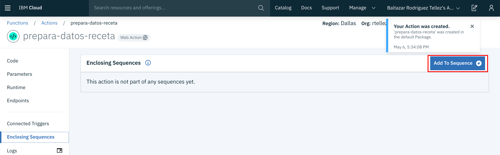

# Creación de las Funciones Serverless
## Introducción
¿Qué es una función serverless? A diferencia de otros mecanismos de despliegue, bajo el paradigma serverless pensamos en funciones o acciones que son disparadas ante alguna forma de evento. Bajo este paradigma, nos olvidamos de administrar o desplegar equipos y middleware, preocupandonos únicamente por nuestra lógica aplicativa.

Como modelo de operación es sumamente relevante, pues se paga únicamente con base a las invocaciones a nuestras funciones y no existe infraestructura sub utilizada. Así mismo, la escalabilidad es inmediata e instantánea sobre un pool de recursos públicos compartidos.

## Configuración
1. Entramos a el  y nos firmamos en caso de ser necesario. Seleccionamos el icono superior izquierdo, lo que despliega un menú de donde seleccionaremos la opción __Functions__ 

2. Al entrar al panel de control de los __IBM Cloud Functions__ elegimos del menú del lado izquierdo la función __Actions__ 

3. Una vez dentro de __Actions__ debemos dar click en el botón de crear acción 

4. Para crear la acción debemos llenar la ficha de meta datos, para lo que crearemos el nombre (prepara-datos-receta) y acto seguido damos click en el botón de crear 

5. Al entrar al editor de código, debemos capturar los siguientes datos 
```
/**
 * Prepara la entrada al recetario para ser persistida
 */
function main(params) {
  if (!params.nombre || !params.calorias) {
    return Promise.reject({ error: 'no se especifica nombre o calorías'});
  }

  return {
    doc: {
      creadoEl: new Date(),
       nombre: params.nombre,
       calorias: params.calorias,
       preparacion: params.preparacion
    }
  };
}
```

6. Una vez capturado el código, lo salvamos dando click en el botón de salvar 

7. Una vez que hemos salvado, debemos seleccionar la opción de __Enclosing Sequences__ del menú del la izquierda. 

8. Como aún no hemos creado una secuencia, debemos dar click sobre el botón de __Add to Sequence__. 

9. En la pantalla de creación de secuencia, debemos asegurarnos de que seleccionamos la opción __Create New__, luego ponemos el nombre __salva-receta__ y finalmente hacemos click en __Create & add__ 