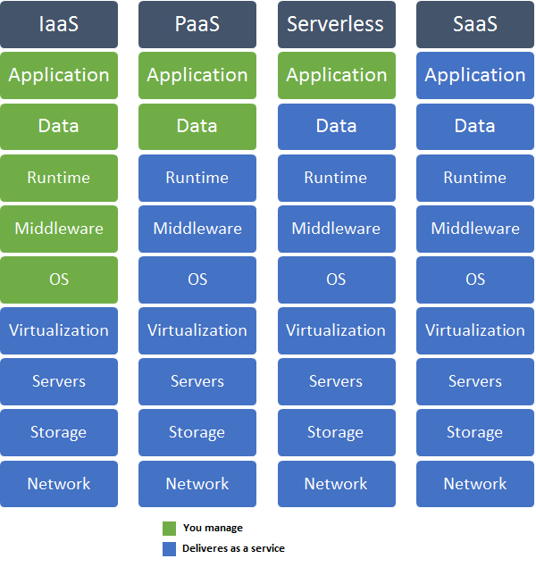

# Tutorial de Funcionalidad Serverless
Este repositorio contiene un tutorial de funciones serverless para manejo de una base de datos documental y para la elaboración de APIs

## Introducción
En la ruta de abstracción de la nube, la última generación de servicios en la nube son las funciones __serverless__. El siguiente diagrama explica el nuevo paradigma de abstracción

## Secciones
1. 
2. Creando las funciones sobre demanda
